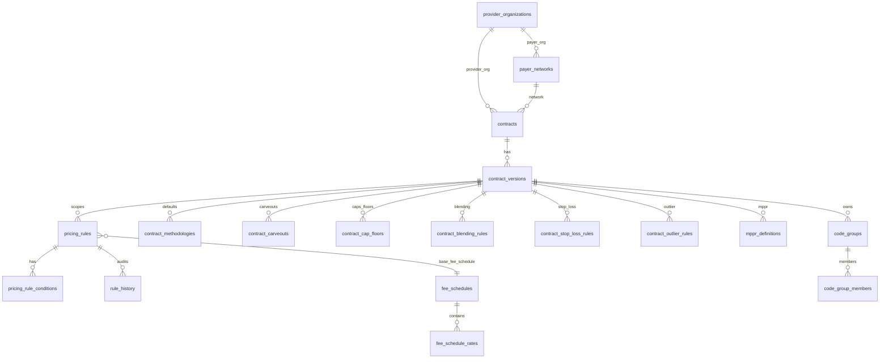

# Data model — PricingEngineDjango

This document summarizes the **relevant MySQL tables** used by the pricing engine and the analyst UI. The authoritative mapping is in `core/models.py` (`db_table = ...` for each model).

**Canonical:** [ROADMAP.md](ROADMAP.md) · [UPGRADE_PLAN.md](UPGRADE_PLAN.md) · [STATUS.md](STATUS.md) · [ARCHITECTURE.md](ARCHITECTURE.md)

## Core relationships (what “pricing a contract version” means)

**Rule of thumb**

- **`contracts`** defines the agreement.
- **`contract_versions`** defines a versioned snapshot of policy and configuration.
- **`pricing_rules` + `pricing_rule_conditions`** decide *which methodology applies* to a line.
- **`contract_*` policy tables** (carveouts/caps/blending/stop-loss/outlier/MPPR) modify results after base methodology.
- **Reference tables** (`ref_*`) and **fee schedules** provide rates/weights/metadata used during calculation.

## Table catalog (grouped by purpose)

### A) Reference data (loaded from CMS/vendor files)

These tables are shared across all contracts.

| Table | Model | Used for |
|------:|-------|----------|
| `ref_cpt_hcpcs_codes` | `RefCptHcpcsCode` | CPT/HCPCS code master |
| `ref_mpfs_rvu` | `RefMpfsRvu` | MPFS RVUs for **RBRVS** |
| `ref_geo_indices` | `RefGeoIndex` | GPCI / locality adjustment (when enabled) |
| `ref_modifiers` | `RefModifier` | Base modifier % adjustments |
| `ref_drg` | `RefDrg` | DRG relative weights for **DRG** |
| `ref_apc` | `RefApc` | APC weights/rates (when APC/OPPS paths are used) |
| `ref_revenue_codes` | `RefRevenueCode` | Revenue code lookup for conditions / carveouts |
| `ref_specialties` | `RefSpecialty` | Specialty master (used by scopes / orgs) |
| `ref_icd10_cm` | `RefIcd10Cm` | Diagnosis codes (optional, future conditions) |
| `ref_icd10_pcs` | `RefIcd10Pcs` | Inpatient procedure codes (optional) |
| `ref_asp_pricing` | `RefAspPricing` | ASP pricing for drug J-codes |
| `ref_procedure_codes` | `RefProcedureCode` | Legacy combined code+RVU table (older path) |

### B) Organizations and contracts

| Table | Model | Used for |
|------:|-------|----------|
| `provider_organizations` | `ProviderOrganization` | Provider/payer organizations |
| `payer_networks` | `PayerNetwork` | Payer network + optional line_of_business |
| `contracts` | `ProviderContract` | Contract header (name, effective dates, status) |
| `contract_scopes` | `ContractScope` | Optional multi-dimension scoping (LOB, specialty, site, geo) |
| `contract_provider_participations` | `ContractProviderParticipation` | Optional: which org/NPI participates and when |

### C) Contract versioning and audit

| Table | Model | Used for |
|------:|-------|----------|
| `contract_versions` | `ContractVersion` | Version PK = **`version_id`** (this is what the UI selects) |
| `contract_version_audit` | `ContractVersionAudit` | Audit of changes to a version |

### D) Rule system (the resolver reads these every run)

| Table | Model | Used for |
|------:|-------|----------|
| `pricing_rules` | `PricingRule` | Methodology + parameters; status (DRAFT/ACTIVE/RETIRED); effective dates; optional version scope |
| `pricing_rule_conditions` | `PricingRuleCondition` | Condition rows (AND). Common: `procedure_code`, `code_group`, `revenue_code` |
| `rule_history` | `RuleHistory` | Audit trail for rule status changes (UI “Audit history”) |

### E) Fee schedules (rate lookup)

| Table | Model | Used for |
|------:|-------|----------|
| `fee_schedules` | `FeeSchedule` | Fee schedule header |
| `fee_schedule_rates` | `FeeScheduleRate` | Per-code rates (effective-dated) |

### F) Default methodologies and policy tables (version-scoped configuration)

These tables usually join by **`version_id`** and are loaded into the in-memory `ContractPricingConfig`.

| Table | Model | Used for |
|------:|-------|----------|
| `contract_methodologies` | `ContractMethodology` | Default methodology when `pricing_rules.methodology_code` is blank |
| `contract_terms` | `ContractTerm` | Effective-dated multipliers (referenced by rules/methodologies) |
| `tier_multipliers` | `TierMultiplier` | Step 14a tiered conversion factor (feature-flagged) |
| `code_groups` | `CodeGroup` | Code sets referenced by rule conditions (`code_group`) |
| `code_group_members` | `CodeGroupMember` | Code membership (effective-dated) |
| `per_diem_rates` | `PerDiemRate` | PER_DIEM rates when referenced by a rule |
| `contract_flat_rate_overrides` | `ContractFlatRateOverride` | Flat-rate overrides when referenced by a rule |
| `modifier_adjustments` | `ModifierAdjustment` | Contract-specific modifier % overrides |
| `contract_base_rates` | `ContractBaseRate` | Base rates (methodology-specific) |
| `facility_base_rates` | `FacilityBaseRate` | Facility base rate for claim-level DRG path |
| `case_rate_definitions` | `CaseRateDefinition` | Case rate definitions |
| `mppr_definitions` | `MPPRDefinition` | Cross-line MPPR configuration |
| `mppr_scopes` | `MPPRScope` | Codes/scopes for MPPR |
| `contract_carveouts` | `ContractCarveout` | Line carve-outs (exclude / % billed / fixed) |
| `contract_cap_floors` | `ContractCapFloor` | Line and claim caps/floors |
| `contract_blending_rules` | `ContractBlendingRule` | Blending rules |
| `contract_stop_loss_rules` | `ContractStopLossRule` | Stop-loss rules |
| `contract_outlier_rules` | `ContractOutlierRule` | Outlier rules |

### G) Stored claims and validation (not required for JSON simulation)

| Table | Model | Used for |
|------:|-------|----------|
| `claim_headers` | `ClaimHeader` | Persisted claim header (optional flows) |
| `claim_lines` | `ClaimLine` | Persisted claim lines (optional flows) |
| `contract_validation_results` | `ValidationResult` | Persisted validation findings (bulk validation / governance) |

## Which tables are used by key UI / API flows

### Claim Simulation UI (`/claim-simulation`) → `POST /api/price-claim-simulate/`

- **Required (almost always)**: `contracts`, `contract_versions`, `pricing_rules`, `pricing_rule_conditions`
- **Often used (depends on methodology/policy)**:
  - Fee schedule pricing: `fee_schedules`, `fee_schedule_rates`, `ref_mpfs_rvu`, `ref_cpt_hcpcs_codes`, `ref_geo_indices`
  - DRG pricing: `ref_drg`, `facility_base_rates`, `contract_base_rates`
  - Caps/carveouts/etc: `contract_carveouts`, `contract_cap_floors`, `contract_blending_rules`, `contract_stop_loss_rules`, `contract_outlier_rules`, `mppr_definitions`, `mppr_scopes`
  - Code groups: `code_groups`, `code_group_members`

### Pricing Sandbox UI (`/pricing-sandbox`) → `POST /api/price-line/`

- Same pricing tables as above, but commonly exercised with rules that are not version-scoped (depends on your data).

### Rules UI (`/rules`, `/rules/:id`, create wizard)

- `pricing_rules`, `pricing_rule_conditions`, `rule_history`
- Contract context: `contracts`, `contract_versions` (for version display/selection)
- Governance endpoints may read/write `contract_validation_results`

## Practical notes / gotchas

- **Version identity**: The UI and simulation APIs use **`contract_versions.version_id`** (PK), not `version_number`.
- **Rule matching**: The resolver matches **ACTIVE** rules and requires at least one condition row; conditions are ANDed.
- **Reference data**: If reference tables like `ref_drg` or `ref_mpfs_rvu` are empty, seeded demo contracts that depend on them will not price realistically.

