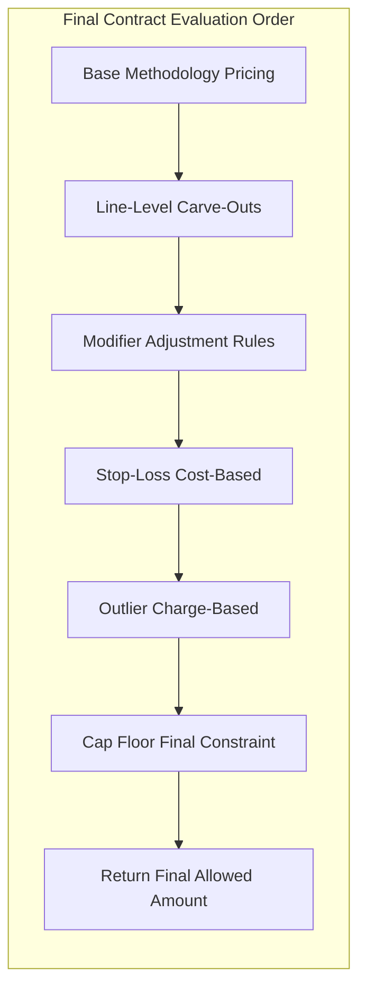

# Runbook: Matrix Pricing Engine (PricingEngineDjango)

Quick reference for running the backend and frontend locally.

**Project docs:** [ROADMAP.md](ROADMAP.md) · [UPGRADE_PLAN.md](UPGRADE_PLAN.md) · [STATUS.md](STATUS.md) · [testing/](testing/) · [TEST_PLAYBOOK.md](testing/TEST_PLAYBOOK.md)

---

## Prerequisites

- Python 3.10+ with venv
- Node.js 18+ and npm (for React frontend)
- MySQL (or configured database per `config/settings.py`)

---

## Backend (Django)

### 1. Migrations

```bash
cd PricingEngineDjango
python manage.py migrate
```

### 2. Seed data (Matrix 2025 contract + RBRVS rule for 99213)

```bash
python manage.py seed_matrix
```

**Deterministic demo contracts** (recommended for UI testing and regression):

```bash
python manage.py seed_demo
```

See [DEMO_TEST_CASES.md](DEMO_TEST_CASES.md) for claim JSON and expected amounts per `DEMO_*` contract.

### 3. Load reference data (procedure codes, modifiers)

Procedure codes and modifiers can be loaded from CSV for demos and simulation.

**Load everything in `reference_data/` (Steps 1–3):**

```bash
# All at once (modifiers, PPRRVU → RefCptHcpcsCode + RefMpfsRvu, GPCI → RefGeoIndex)
python manage.py load_reference_data

# Preview only
python manage.py load_reference_data --dry-run
```

Expects `reference_data/modifiers.csv`, `reference_data/PPRRVU25_JAN.csv`, `reference_data/GPCI2025.csv`.

**Data sources (examples; confirm licensing for your use):**

- **CPT/HCPCS and RVUs:** CMS publishes PFS (Physician Fee Schedule) and RBRVS data. Export or obtain CSV with columns: `code_id`, `code_type`, `description`, `work_rvu`, `pe_rvu`, `mp_rvu`.
- **Modifiers:** CMS and other sources publish modifier lists. CSV columns: `modifier_code`, `description`, `percentage_adjustment` (optional; default 100).

**Load steps:**

```bash
# Procedure codes only
python manage.py load_cms_codes --path /path/to/codes.csv

# Procedure codes + modifiers
python manage.py load_cms_codes --path /path/to/codes.csv --modifiers /path/to/modifiers.csv

# Preview without writing to DB
python manage.py load_cms_codes --path /path/to/codes.csv --dry-run
```

After loading, the API exposes:

- `GET /api/procedure-codes/?q=99213` — search by code or description; optional `?limit=20`
- `GET /api/modifiers/?q=26` — list modifiers; optional `?limit=20`

### Step 2 & 3: CPT/HCPCS, MPFS RVU, GPCI

- **Step 2:** `load_pprrvu` loads **RefCptHcpcsCode** (code master) and **RefMpfsRvu** (RVUs by code+year) from PPRRVU CSV (e.g. `PPRRVU25_JAN.csv`). Skips 9 header rows; infers year from filename or `--year 2025`.
- **Step 3:** `load_gpci` loads **RefGeoIndex** (GPCI by locality) from CMS GPCI CSV (e.g. `GPCI2025.csv`). Skips 3 rows; `locality_code` = State + Locality Number.

```bash
python manage.py load_pprrvu --path reference_data/PPRRVU25_JAN.csv --year 2025
python manage.py load_gpci --path reference_data/GPCI2025.csv --year 2025
```

### DRG and APC reference (Phase 2)

**Data sources (examples; confirm licensing):**

- **DRG:** CMS IPPS (e.g. **FY2025 IPPS Final Rule and Correction Notice Table 5.xlsx**) or CSV. Columns: `drg_code`, `description`, `relative_weight`, `geometric_mean_los`, `arithmetic_mean_los`, `mdc`, `year`.
- **APC:** CMS OPPS (e.g. **January 2025 Web Addendum B.12.31.24.xlsx**) or CSV. Columns: `apc_code`, `description`, `relative_weight`, `status_indicator`, `payment_rate`, `year`.

Loaders accept **CSV or Excel** (.xlsx, .xls). For Excel, use `--year` (and for ASP, `--quarter`) when the file has no year/quarter column. Use `--excel-skip-rows N` if the header is not the first row.

**Load steps:**

```bash
# DRG from IPPS Table 5 Excel
python manage.py load_drg --path "reference_data/FY2025 IPPS Final Rule and Correction Notice Table 5.xlsx" --year 2025
python manage.py load_drg --path /path/to/drg.csv --dry-run

# APC from Web Addendum B Excel
python manage.py load_apc --path "reference_data/January 2025 Web Addendum B.12.31.24.xlsx" --year 2025
python manage.py load_apc --path /path/to/apc.csv --dry-run
```

After loading:

- `GET /api/drg/?year=2024` — list DRG reference; optional `?q=`, `?limit=`
- `GET /api/apc/?year=2024` — list APC reference; optional `?q=`, `?limit=`

### Phase 3: ICD-10 and ASP reference

**Data sources (examples; confirm licensing):**

- **ICD-10-CM:** Diagnosis codes. CSV columns: `diagnosis_code`, `description`, `billable_flag`, `effective_year`.
- **ICD-10-PCS:** Procedure codes. CSV columns: `procedure_code`, `description`, `section`, `body_system`, `year`.
- **ASP:** Average Sales Price for drug J-codes. Use **January 2025 ASP NDC-HCPCS Crosswalk updated 052725.xls** (or CSV). Columns: `hcpcs_code`, `quarter` (e.g. `2025-Q1`), `asp`, `payment_limit` (optional). For Excel without a quarter column, use `--quarter 2025-Q1`; quarter can be inferred from filename (e.g. "January 2025" → 2025-Q1).

**Load steps:**

```bash
python manage.py load_icd10_cm --path /path/to/icd10_cm.csv
python manage.py load_asp_pricing --path "reference_data/January 2025 ASP NDC-HCPCS Crosswalk updated 052725.xls" --quarter 2025-Q1
# Or CSV: python manage.py load_asp_pricing --path /path/to/asp.csv
python manage.py load_icd10_pcs --path /path/to/icd10_pcs.csv   # optional
# Add --dry-run to preview.
```

**APIs:**

- `GET /api/icd10-cm/?q=...&effective_year=2024&limit=20` — ICD-10-CM diagnosis codes.
- `GET /api/icd10-pcs/?q=...&year=2024&limit=20` — ICD-10-PCS procedure codes.
- `GET /api/asp-pricing/?hcpcs_code=J...&quarter=2024-Q1` — ASP pricing (for future drug methodology).

**Engine:** `PricingContext` has optional `asp_price` and `asp_payment_limit`. When methodology is DRUG/ASP, the loader looks up `RefAspPricing` by procedure code and quarter from service date; a full drug strategy can be added later.

### Phase 4: Revenue codes and specialties

**Data sources (examples):**

- **Revenue codes:** CSV columns: `revenue_code`, `description`, `category`.
- **Specialties:** CSV columns: `specialty_code`, `description`.

**Load steps:**

```bash
python manage.py load_revenue_codes --path /path/to/revenue_codes.csv
python manage.py load_specialties --path /path/to/specialties.csv
# Add --dry-run to preview.
```

**APIs:**

- `GET /api/revenue-codes/?q=...&category=...&limit=20` — revenue codes.
- `GET /api/specialties/?q=...&limit=20` — provider specialties.
- Contract detail `GET /api/contracts/<id>/` includes `primary_specialty_id` and `primary_specialty` (code + description) from the contract’s provider organization when set.

**Models:** `RefRevenueCode`, `RefSpecialty`. `ProviderOrganization` has optional `primary_specialty` FK to `RefSpecialty`.

### 4. Run tests

```bash
python manage.py test tests
```

### 5. Start server

```bash
python manage.py runserver
```

- API base: `http://localhost:8000/api/`
- Django sandbox UI: `http://localhost:8000/sandbox/`

---

## Frontend (React)

### 1. Install and run

```bash
cd PricingEngineDjango/frontend
npm install
npm run dev
```

- App: `http://localhost:5173/`
- Set `VITE_API_BASE_URL=http://localhost:8000/api` in `.env.development` so the Pricing Sandbox calls the Django API.

### 2. Production build

```bash
cd PricingEngineDjango/frontend
npm run build
npm run preview   # optional: preview dist
```

---

## Phase 2B: Contract methodology and override rule

**Methodology override (rule vs contract):**

- If a **pricing rule** has `methodology_code` **set (non-null, non-blank)** → that rule **overrides** the contract’s methodology for that rule (conversion factor, fee schedule, and methodology type come from the rule).
- If a **pricing rule** has `methodology_code` **null or blank** → the rule **inherits** from the contract’s **ContractMethodology** for the given date (and optional claim_type). The resolver and loader use the contract’s methodologies to get methodology_type, conversion_factor, and fee_schedule.

**APIs:**

- `GET /api/contracts/<id>/` — contract detail includes `line_of_business` and `methodologies` (list).
- `GET /api/contracts/<id>/methodologies/` — list methodologies for the contract.
- `POST /api/contracts/<id>/methodologies/` — create a contract methodology (body: methodology_type, effective_date, conversion_factor, fee_schedule_id, claim_type, etc.).

**Pricing/simulation:** Optional `service_date` and `claim_type` on price-line and simulate-line requests so the engine can resolve contract methodology by date and filter rules by claim type.

---

## Phase 5: Effective dating and claim context

**Behavior:**

- **Conditions** do not have their own effective dates; they inherit the parent rule’s `effective_start_date` and `effective_end_date`. Documented on `PricingRuleCondition` and applied in the resolver.
- **Resolver:** Only considers rules where `effective_start_date <= service_date <= effective_end_date` (null end = open-ended). Uses `service_date` from the request; default is today. Applied **before** condition matching.
- **Loader:** When loading `FeeScheduleRate`, filters by `service_date`: rate is used only if `effective_start_date <= service_date <= effective_end_date` (when those fields are set). Fallback: unrestricted when no rate matches.
- **Claim context:** All pricing/simulation endpoints accept and pass through `service_date`, `pricing_date`, `contract_effective_date` (optional). Used by resolver and loader.

**APIs:** Price-line, simulate-line, and price-claim accept optional `service_date`, `pricing_date`, `contract_effective_date`. Price-claim can send claim-level dates and/or per-line dates.

---

## Phase 5B: Stored claims (bulk simulation)

**Models:** `ClaimHeader` (contract, member_id, service_date, claim_type, drg_code, line_of_business, pricing_date) and `ClaimLine` (claim, procedure_code, modifiers JSON, billed_amount, units, sequence).

**APIs:**

- `POST /api/claims/` — Create a claim: body includes `contract_id`, `service_date`, `lines` (array of `{ procedure_code, modifiers, billed_amount, units, sequence }`). Optional: `member_id`, `claim_type`, `drg_code`, `line_of_business`, `pricing_date`.
- `GET /api/claims/` — List claims; optional `?contract_id=`.
- `GET /api/claims/<id>/` — Single claim with lines.
- `GET /api/claims/<id>/price/` or `POST /api/claims/<id>/price/` — Run pricing on the stored claim; returns `claim_id`, `contract_id`, `total_allowed`, `line_count`, `lines` (per-line results).

**Engine:** `PricingEngine.calculate_claim(claim_header)` prices all lines using the header’s `service_date`, `claim_type`, and contract; aggregates `total_allowed`.

---

## Phase 5C: Materialized contract snapshot (optional)

**Goal:** For 100s of contracts simulation, avoid re-resolving the methodology graph on every request.

**Implementation:**

- **Service:** `core/services/contract_snapshot.py` — `build_contract_snapshot(contract)` builds a JSON-serializable config (methodologies, rules, fee_schedule_ids, outlier_rules). `get_or_build_snapshot(contract)` returns cached snapshot or builds and caches it. `invalidate_snapshot(contract_id)` clears the cache.
- **Cache:** Django cache (default backend). Key: `contract_snapshot:<contract_id>`. Timeout: 1 hour. Cache is invalidated via signals when `ContractMethodology`, `PricingRule`, or `ContractOutlierRule` for that contract is saved or deleted.
- **API:** `GET /api/contracts/<id>/snapshot/` — returns the materialized contract runtime config (cached). Use for dashboards or as input to bulk simulation without re-querying methodologies and rules.

---

## Phase 6: Contract outlier rules and stop-loss precedence

**Goal:** Outlier/stop-loss with explicit evaluation order. **Stop-loss runs before outlier**; if both apply, outlier overrides the final total.

**Model:** `ContractOutlierRule` — `contract` (FK), `threshold_amount`, `threshold_scope` (PER_CLAIM, PER_LINE), `reimbursement_percentage`, `cost_to_charge_ratio`, `priority`, `effective_start_date`, `effective_end_date`. Table: `contract_outlier_rules`. DB constraint: at least one of `reimbursement_percentage` or `cost_to_charge_ratio` required. **ContractStopLossRule** (Phase 6b) applies at claim level before outlier; uses `ClaimLine.cost_amount`.

**Precedence (documented):** (1) Base rules (RBRVS, DRG, FLAT_RATE); (2) Adjustment rules; (3) Stop-loss (cost-based); (4) Outlier (charge-based); per-claim or per-line by `threshold_scope` (PER_CLAIM, PER_LINE); multiple tiers by `priority`.

**APIs:**

- `GET /api/contracts/<id>/outlier-rules/` — list outlier rules for the contract.
- `POST /api/contracts/<id>/outlier-rules/` — create an outlier rule (body: threshold_amount, threshold_scope [PER_CLAIM only; PER_LINE rejected], reimbursement_percentage, cost_to_charge_ratio, priority, effective_start_date, effective_end_date).
- `GET /api/contracts/<id>/stop-loss-rules/`, `POST /api/contracts/<id>/stop-loss-rules/` — stop-loss rules.

**UI:** Contract detail can show an "Outlier rules" section using these endpoints.

---

## Final Contract Evaluation Order (authoritative)

All future phases must conform to this precedence. The engine evaluates in this order:



1. **Base Methodology Pricing**
2. **Line-Level Carve-Outs** (planned; Phase 7)
3. **Modifier / Adjustment Rules**
4. **Stop-Loss (Cost-Based)**
5. **Outlier (Charge-Based)**
6. **Cap / Floor (Final Constraint)** (planned; Phase 8)
7. **Return Final Allowed Amount**

---

## Important Architectural Rule

All override mechanisms must:

- Preserve `original_total_allowed`
- Preserve intermediate stage values
- Record applied rule IDs
- Maintain deterministic precedence
- Be idempotent

---

## Phase 10: Indexes and performance

**Indexes (migrations):** Resolver and loader use composite indexes on `pricing_rules` (contract + effective dates; contract + claim_type + specificity_score), `pricing_rule_conditions` (rule_id), `fee_schedule_rates` (fee_schedule + code_id; code_id + effective dates), and `ref_drg` / `ref_apc` (code + year). **Specificity:** `specificity_score` is not computed at query time; it is updated on rule/condition save via `calculate_score()` (API) and via signals when a `PricingRuleCondition` is saved or deleted.

**Queries:** Resolver uses `select_related('contract', 'base_fee_schedule')` and `prefetch_related('conditions')` to avoid N+1.

---

## Quick smoke test

1. Start Django: `python manage.py runserver`
2. Start React: `cd frontend && npm run dev`
3. Open `http://localhost:5173/pricing-sandbox`, enter contract ID (e.g. `CONT-MATRIX-2026` or `1`) and procedure code `99213`, click "Price line" — expect a JSON response with `allowed_amount` and `status: "SUCCESS"`.
